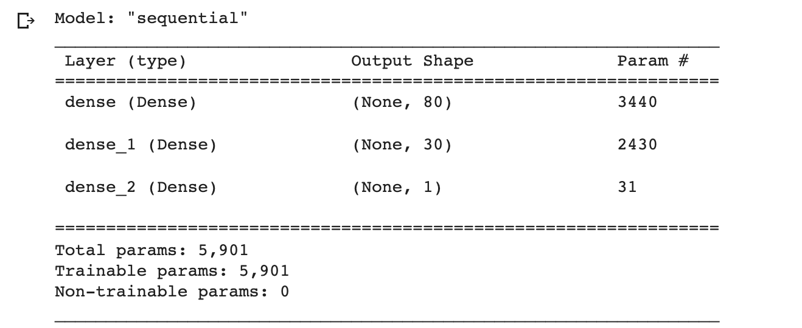
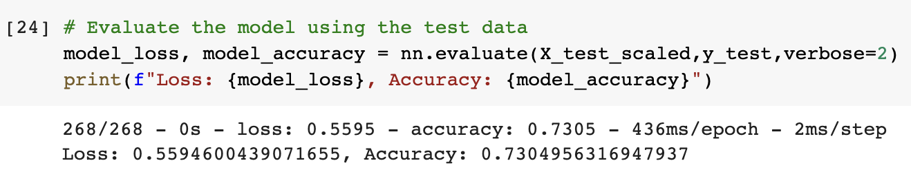

# Charity Analysis

## Overview
The goal of this project is to help a non-profit foundation to identify funding applications that are most likely to be successful. A neural network model was developed to address this classification problem.

## Results
### Preprocessing
- The target variable for this analysis is labeled 'IS_SUCCESSFUL', reflecting whether the given project was determined to be a successful donation.

- The features which could be predictive include: APPLICATION_TYPE, AFFILIATION, CLASSIFICATION, USE_CASE, ORGANIZATION, INCOME_AMT, SPECIAL CONSIDERATIONS, and ASK_AMT.

- ID features, EIN and NAME are excluded from modeling.

### Compiling, Training and Evaluating the Model
- The first step in optimizing the model was to drop the STATUS variable, because there were so few observations that it was uninformative. 
- Additional preprocessing attempts included dropping SPECIAL_CONSIDERATIONS, and condensing rare categories on other variables. These steps resulted in worse performance.
- A third hidden layer was added, also resulting in worse performance.
- The number of neurons in the second hidden layer was increased to the same as the first hidden layer. This model also performed worse than the original parameters after dropping STATUS. 
- The best model that I tested included the original parameters for the model, after removing one uninformative feature. Unfortunately I was unable to improve model performance to the target of 0.75.

## Summary
I was not able to optimize the neural network to the point where it was successful enough for deployment. One of the challenges I dealt with was the length of time it takes for the neural network to run each time. 
As a binary classification problem with numerical data, a Random Forest model might be just as successful but require less resources to develop and optimize. 
